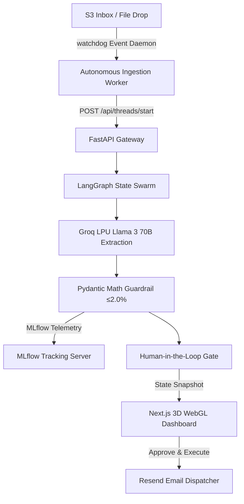

# Event-Driven Agentic Procurement Swarm

An enterprise, event-driven multi-agent contract negotiation architecture powered by **LangGraph**, **Groq LPU (Llama 3 70B)**, **MLflow GenAI Tracing & Observability**, and a **Next.js WebGL 3D Glassmorphism Dashboard**.

---

## 🏛️ System Architecture



---

## 🌟 Key Features

1. **Event-Driven Ingestion Daemon**: Monitors file drops (AWS EventBridge/S3 pattern) to trigger agent workflows automatically without manual UI clicks.
2. **Deterministic Math Guardrail**: Enforces strict $\le 2.0\%$ discount tolerance using Pydantic model validators, preventing LLM hallucinated calculations.
3. **Sub-300ms Inference**: Powered by Groq LPU (`llama-3.3-70b-versatile`) with streaming JSON object extraction.
4. **MLflow 3.x Observability**: Native logging of execution latencies, token counts, model params, and GenAI Tracing spans.
5. **Palantir Foundry-Style WebGL UI**: Built with Next.js App Router, Three.js (`@react-three/fiber`), Framer Motion glassmorphism panels, and an autonomous polling radar.
6. **Durable State Machine**: LangGraph state checkpointer supporting Human-in-the-Loop `interrupt()` and email execution via Resend.

---

## ⚡ Quick Start

### 1. Backend & MLflow Server
```bash
# Activate virtual environment
source venv/bin/activate

# Launch MLflow Tracking Server (Port 5001)
mlflow server --host 0.0.0.0 --port 5001 &

# Launch FastAPI Server (Port 8000)
uvicorn backend.main:app --port 8000 --reload
```

### 2. Autonomous File Ingestion Worker
```bash
# Launch S3 Inbox Watchdog Daemon
python backend/worker.py
```

### 3. Next.js WebGL Dashboard
```bash
cd frontend
npm install
npm run dev -- -p 3001
```

---

## 🧪 Execution Flow

To trigger the end-to-end autonomous workflow:
1. Open **[http://localhost:3001/](http://localhost:3001/)** in your browser.
2. Drop any contract `.pdf` file into `s3_inbox/`.
3. The background worker parses the file, triggers the backend graph, logs runs & traces to MLflow (**[http://localhost:5001](http://localhost:5001)**), and populates the Next.js glassmorphism counter-offer card automatically.
4. Enter target email address and click **Approve & Execute Email** to dispatch the proposal via Resend API.
